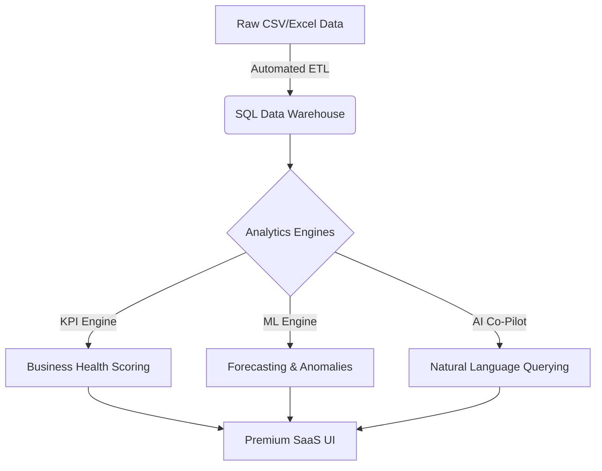

# 💎 Enterprise SaaS Analytics & AI Co-Pilot

A state-of-the-art, end-to-end business intelligence platform designed for the modern enterprise. This suite transforms raw operational data into executive-level insights using advanced ETL, SQL warehousing, and a semantic AI Co-Pilot.

## 🚀 Killer Features

- **🤖 AI Co-Pilot**: "Ask Your Business Data" anything using natural language.
- **✨ Premium SaaS UI**: Modern glassmorphism design system inspired by Stripe and Datadog.
- **📈 Advanced Analytics**: MoM/YoY growth tracking, Business Health Scoring, and Trend Decomposition.
- **🔮 Predictive Intelligence**: 30-day automated revenue forecasting and statistical anomaly detection.
- **🏢 Multi-Dimensional Modeling**: Deep dives into Region, Department, Inventory, and Employee Productivity.
- **🔐 Enterprise Security**: Secure authentication and session-level data protection.

## 🛠 Tech Stack

- **UI/UX**: Streamlit, Custom CSS (Glassmorphism), Plotly Premium
- **Data Engineering**: Python, Pandas (v3.0+), NumPy
- **Database**: SQLAlchemy, PostgreSQL / SQLite
- **AI/ML**: Scikit-learn, Semantic Reasoning Engine
- **DevOps**: Docker, Docker Compose

## 🏗 Architecture



## 📂 Project Structure

```text
business-analytics-dashboard/
├── app/
│   ├── analytics/      # Advanced KPI & Anomaly detection
│   ├── ai_insights/    # AI Co-Pilot semantic engine
│   ├── database/       # SQLAlchemy models & session
│   ├── utils/          # Styling system & data generation
│   └── etl/            # High-performance ETL pipeline
├── pages/              # Multi-page SaaS routes
├── main.py             # Entry point & Security
├── Dockerfile          # Production container
└── docker-compose.yml  # Full-stack orchestration
```

## 🚥 Quick Start

### 1. Docker (Recommended)
```bash
docker compose up --build
```

### 2. Local
```bash
python3 -m pip install -r requirements.txt
streamlit run main.py
```

## 📈 Usage
1. **Login**: `admin` / `admin123`.
2. **AI Co-Pilot**: Navigate to the Co-Pilot page and ask "Which region has the highest revenue?".
3. **Executive Dashboard**: View global health scores and growth metrics.

---
*Transforming Data into Decision Intelligence.*
